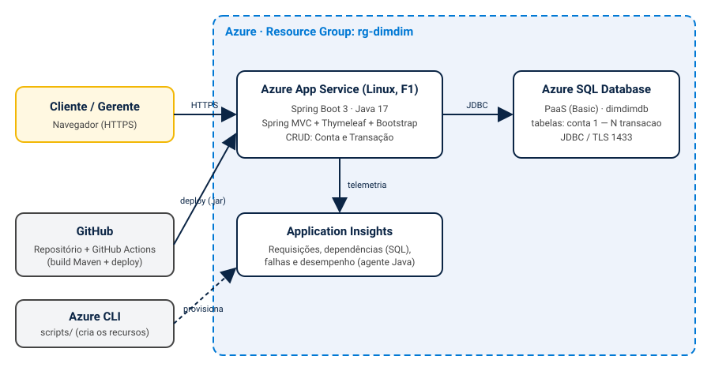
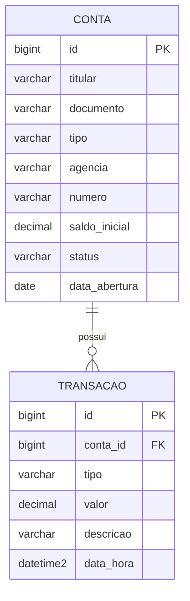

# DimDim Digital – Portal de Contas e Transações na Nuvem

> 2º Checkpoint – DevOps Tools & Cloud Computing (FIAP) – Aplicativos e Banco em Nuvem

| | |
|---|---|
| **Grupo** | _<nome do grupo>_ |
| **Integrantes** | _<RM – Nome>_ |
| **Vídeo (evidências)** | _<link do vídeo>_ |
| **Aplicação publicada** | `https://dimdim-web-<seu-rm>.azurewebsites.net` |

## 1. Descrição da solução

A **DimDim** é um banco comercial com mais de 1 milhão de correntistas, parque tecnológico obsoleto
(servidores físicos, sem ambientes intermediários) e um canal digital que sofre com perda de
desempenho e quedas de conexão. O objetivo do projeto é **expandir a atuação online** com uma
aplicação web hospedada em nuvem (Microsoft Azure), com deploy automatizado e monitoramento.

O **DimDim Digital** é um portal web (front-end renderizado no servidor, **não é API**) em que a
equipe do banco:

- **abre e mantém contas** (titular, CPF/CNPJ, tipo, agência, número, saldo inicial, status);
- **registra movimentações** nas contas (depósito, saque, transferência enviada, pagamento de boleto);
- consulta o **extrato** e o **saldo** de cada conta e um painel inicial com indicadores.

Regras de negócio: o saldo é calculado a partir do saldo inicial e das transações; saques/débitos
não podem deixar o saldo negativo; só contas **Ativas** podem ser movimentadas; contas com
transações não podem ser excluídas; agência + número da conta são únicos.

### Stack

| Camada | Tecnologia |
|---|---|
| Front-end | Thymeleaf + Bootstrap 5 + Font Awesome |
| Back-end | Java 17, Spring Boot 3.3 (MVC, Data JPA, Validation) |
| Banco | **Azure SQL Database** (PaaS, SQL Server) |
| Hospedagem | Azure App Service (Linux, Java 17) |
| Monitoramento | **Application Insights** (agente Java do App Service) |
| Deploy | Azure CLI + GitHub Actions (alternativa: `az webapp deploy`) |

## 2. Arquitetura



Fluxo: o usuário acessa o Web App via HTTPS; o Web App persiste os dados no Azure SQL por JDBC
(TLS); o agente do Application Insights coleta requisições, dependências (consultas SQL), falhas e
desempenho. O código vive no GitHub, e o GitHub Actions faz o build Maven e o deploy do `.jar`.
Os recursos são criados com scripts do Azure CLI (pasta [`scripts/`](scripts)).

## 3. Modelo de dados



DDL completo em [`scripts/ddl.sql`](scripts/ddl.sql).

### CRUD

| Tabela | Create | Read | Update | Delete |
|---|---|---|---|---|
| `conta` | `/contas/new` | `/contas`, `/contas/{id}` (extrato) | `/contas/{id}/edit` | botão **Excluir** em `/contas` |
| `transacao` | `/transacoes/new` | `/transacoes` | `/transacoes/{id}/edit` | botão **Excluir** em `/transacoes` |

> A aplicação é um front-end web (formulários), por isso não há JSON de GET/POST/PUT/DELETE.

## 4. Estrutura do repositório

```
├── src/                      código-fonte (Spring Boot + templates Thymeleaf)
├── scripts/
│   ├── ddl.sql               DDL das tabelas (T-SQL)
│   ├── consultas-evidencia.sql  SELECTs para mostrar a persistência no vídeo
│   ├── 01-criar-recursos.sh  Azure CLI: RG, App Insights, SQL, Web App, variáveis
│   ├── 02-deploy-github-actions.sh  Azure CLI: cria o workflow de CI/CD
│   ├── 03-deploy-manual.sh   Azure CLI: deploy do .jar (alternativa)
│   └── 99-limpar-recursos.sh remove todos os recursos
├── docs/arquitetura.svg      desenho da arquitetura
└── pom.xml
```

## 5. How-to – implantação na nuvem

Pré-requisitos: conta no Azure (assinatura de estudante), conta no GitHub e acesso ao
**Azure Cloud Shell (Bash)** em <https://portal.azure.com>.

### Passo 1 – Fork/clone do projeto

1. Faça o *fork* (ou envie este código para um repositório seu) no GitHub.
2. No Cloud Shell:

```bash
git clone https://github.com/<seu-usuario>/<seu-repositorio>.git
cd <seu-repositorio>
```

### Passo 2 – Criar os recursos no Azure

Troque `rm999999` pelo seu RM. Se a criação do SQL falhar por falta de capacidade na região,
defina outra em `SQL_LOCATION` (ex.: `eastus2`). A senha do SQL é pedida durante a execução
(não fica em arquivo).

```bash
export RM="rm999999"
export LOCATION="brazilsouth"
bash scripts/01-criar-recursos.sh
```

O script cria: Resource Group `rg-dimdim`, Application Insights `ai-dimdim`, servidor Azure SQL
`dimdim-sql-<rm>` com o banco `dimdimdb` (+ regra de firewall para serviços do Azure), plano
`plan-dimdim` (F1, Linux), Web App `dimdim-web-<rm>` (Java 17) e as _App Settings_
(`SPRING_DATASOURCE_URL/USERNAME/PASSWORD` e as variáveis do Application Insights).

### Passo 3 – Criar as tabelas (DDL)

No Portal Azure: **SQL databases → dimdimdb → Query editor**, entre com o usuário
`dimdimadmin` e a senha definida no passo 2 (se pedir, use _Add your client IP_ para liberar o
firewall) e execute o conteúdo de [`scripts/ddl.sql`](scripts/ddl.sql).

> Mesmo sem esse passo a aplicação cria as tabelas na primeira execução
> (`spring.jpa.hibernate.ddl-auto=update`), mas o DDL oficial é o do arquivo.

### Passo 4 – Deploy automatizado (GitHub Actions)

```bash
export GITHUB_REPO_NAME="<seu-usuario>/<seu-repositorio>"
bash scripts/02-deploy-github-actions.sh
```

O comando abre o login do GitHub, cria o workflow em `.github/workflows/` e dispara o primeiro
build/deploy. Acompanhe na aba **Actions** do repositório. A cada `git push` na `main` o deploy se repete.

_Alternativa (Azure CLI + `az webapp deploy`):_ `bash scripts/03-deploy-manual.sh`.

### Passo 5 – Testar

Abra `https://dimdim-web-<rm>.azurewebsites.net` (a primeira requisição pode demorar, pois o
plano F1 "dorme"). Execute os CRUDs:

1. **Conta**: abrir, editar, listar e excluir.
2. **Transação**: registrar depósito/saque, editar, listar e excluir.
3. Após **cada operação**, rode [`scripts/consultas-evidencia.sql`](scripts/consultas-evidencia.sql)
   no Query editor para mostrar a persistência em `conta` e `transacao`.

### Passo 6 – Monitorar

No Portal Azure, abra o recurso **ai-dimdim** (Application Insights):

- **Live metrics** e **Transaction search** – requisições `/contas`, `/transacoes` etc.;
- **Application map** e **Performance → Dependencies** – chamadas ao Azure SQL e seus tempos;
- **Failures** – exceções e respostas com erro;
- No recurso do banco (**dimdimdb → Monitoring**) – DTU/CPU e conexões.

### Passo 7 – Limpeza

```bash
bash scripts/99-limpar-recursos.sh
```

## 6. Executar os testes

Os testes usam H2 em memória (não precisam do Azure):

```bash
./mvnw verify
```

A aplicação **não** é executada em localhost para a entrega: ela depende das variáveis
`SPRING_DATASOURCE_*` do banco na nuvem.

## 7. Segurança

Nenhuma credencial é gravada no código ou nos scripts: a senha do SQL é digitada na execução do
script e fica apenas nas _App Settings_ do Web App.
